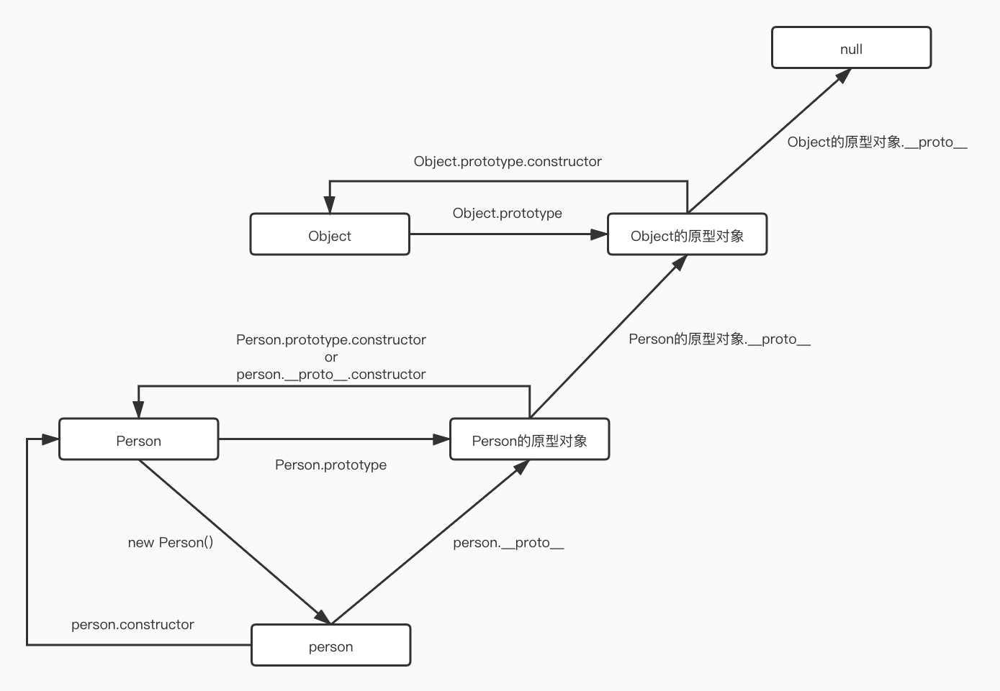

# JavaScript

- [数据类型](#数据类型)
- [数组](#数组)
- [对象](#对象)
- [函数](#函数)
- [原型&继承](#原型&继承)
- [类](#类)
- [错误处理](#错误处理)
- [异步](#异步)


## 数据类型

**基本数据类型**：Boolean Null Undefined [Number](#数字类型) BigInt [String](#字符串类型) Symbol

**引用数据类型**：Object

区别：基本数据类型的值存在栈内存中，引用数据类型的值存在堆内存中


**被当做对象的原始类型**

- null/undefined 没有任何方法
- 这些方法通过临时对象工作，但 JavaScript 引擎可以很好地调整，以在内部对其进行优化，因此调用它们并不需要太高的成本。


```js
/*
 * 1. 创建一个包含字符串字面值的特殊对象，并且具有有用的方法
 * 2. 该方法运行并返回一个新的字符串
 * 3. 特殊对象被销毁，只留下原始值（被返回的新字符串）
 */

let str = "Hello";
alert( str.toUpperCase() );
```

### 数字类型

#### 科学计数法

- 1.23e6 = 1.23 * 1000000 = 1230000
- 1.23e-6 = 1.23 / 1000000 = 0.00000123

#### 进制

- 十六进制 0x（例：0xffffff）
- 八进制 0o（例：0o377）
- 二进制 0b（例：0b11111111）

toString(进制)
```js
  const num = 100;
  num.toString(16); // 64
  num.toString(2); // 1100100
  // 也可以这样
  100..toString(16);
  // or
  (100).toString(16);
```

#### 取整

- Math.floor 向下取整 3.1 -> 3
- Math.ceil  向上取整 3.1 -> 4
- Math.round 四舍五入 3.5 -> 4
- Math.trunc 去小数点后内容 3.1 -> 3
- toFixed(小数点后n位) (12.36).toFixed(1) -> 12.4

#### 杂项

**不精确的计算**

IEEE-754数字格式带来的精度问题（PHP，Java，C，Perl，Ruby也会），可以用`+数字.toFixed(位数)`来解决

```js
alert( 1e500 ); // Infinity
alert( 0.1 + 0.2 ); // 0.30000000000000004
```

**isFinite 和 isNaN**

isNaN(value) 将其参数转换为数字，然后测试它是否为 NaN
isFinite(value) 将其参数转换为数字，如果是常规数字而不是NaN/Infinity/-Infinity，则返回 true

**parseInt 和 parseFloat**

使用`+`和`Number()`的数字转换是严格的。如果一个值不完全是一个数字，就会报错。
`parseInt` 和 `parseFloat`可以从字符串中“读取”数字，直到无法读取为止。如果发生 error，则返回收集到的数字。

```js
alert( parseInt('100px') ); // 100
alert( parseFloat('12.5em') ); // 12.5
alert( parseInt('12.3') ); // 12，只有整数部分被返回了
alert( parseFloat('12.3.4') ); // 12.3，在第二个点出停止了读取
alert( parseInt('a123') ); // NaN，第一个符号停止了读取

// 第二个参数 进制
alert( parseInt('0xff', 16) ); // 255
alert( parseInt('ff', 16) ); // 255，没有 0x 仍然有效
alert( parseInt('2n9c', 36) ); // 123456
```

### 字符串类型

#### 字符串是不可变的

```js
let str = 'hello';
str[0] = 'H'; // 报错
```

#### 改变大小写

`toLowerCase()` 和 `toUpperCase()` 方法可以改变大小写

```js
alert( 'Interface'.toUpperCase() ); // INTERFACE
alert( 'Interface'.toLowerCase() ); // interface
```

#### 查找子字符串

- str.indexOf, str.lastIndexOf

  ```js
  const str = 'hello world';
  str.indexOf('o'); // 4 找到第一个会停下来
  ```

- includes, startsWith, endsWith

  ```js
  alert( "Midget".includes("id") ); // true
  alert( "Midget".includes("id", 3) ); // false, 从位置 3 开始没有 "id"
  ```

#### 获取子字符串

- slice(start, end)	从 start 到 end（不含 end）	允许负值
- substring(start, end)	start 与 end 之间（包括 start，但不包括 end）	负值代表 0
- substr(start, length)	从 start 开始获取长为 length 的字符串	允许 start 为负值

### Map 和 Set

#### Map

Map 是一个带键的数据项的集合，就像一个 Object 一样。 但是它们有一些差别：
- Map 允许任何类型的键（key）
- 每一次 map.set 调用都会返回 map 本身，所以可以进行“链式”调用。
- Object.entries(obj) // 二维数组[[k1, v1], [k2, v2]]
- Object.fromEntries(arr) // {k1: v1}

它的方法和属性如下：

- new Map([['key', value]]) —— 创建 map，可以传参二维数组。
- map.set(key, value) —— 根据键存储值。
- map.get(key) —— 根据键来返回值，如果 map 中不存在对应的 key，则返回 undefined。
- map.has(key) —— 如果 key 存在则返回 true，否则返回 false。
- map.delete(key) —— 删除指定键的值。
- map.clear() —— 清空 map。
- map.size —— 返回当前元素个数。
- map.keys() —— 遍历并返回所有的键（returns an iterable for keys），
- map.values() —— 遍历并返回所有的值（returns an iterable for values），
- map.entries() —— 遍历并返回所有的实体（returns an iterable for entries）[key, value]，for..of 在默认情况下使用的就是这个。

#### Set

Set 是一个特殊的类型集合 —— “值的集合”（没有键），它的每一个值只能出现一次。它的主要方法如下：

- new Set(iterable) —— 创建一个 set，如果提供了一个 iterable 对象（通常是数组），将会从数组里面复制值到 set 中。
- set.add(value) —— 添加一个值，返回 set 本身
- set.delete(value) —— 删除值，如果 value 在这个方法调用的时候存在则返回 true ，否则返回 false。
- set.has(value) —— 如果 value 在 set 中，返回 true，否则返回 false。
- set.clear() —— 清空 set。
- set.size —— 返回元素个数。
- set.keys() —— 遍历并返回所有的值（returns an iterable object for values），
- set.values() —— 与 set.keys() 作用相同，这是为了兼容 Map，
- set.entries() —— 遍历并返回所有的实体（returns an iterable object for entries）[value, value]，它的存在也是为了兼容 Map。


## 函数

### Rest 和 Spread

- `...` 出现在函数参数列表的最后，那么它就是 rest 参数，它会把参数列表中剩余的参数收集到一个数组中。
- `...` 出现在函数调用或类似的表达式中，那它就是 spread 语法，它会把一个数组展开为列表。
- `arguments` 是比较旧的用法，箭头函数没有 `arguments`

### 闭包

>一个函数和对其周围状态（lexical environment，词法环境）的引用捆绑在一起（或者说函数被引用包围），这样的组合就是闭包（closure）。也就是说，闭包让你可以在一个内层函数中访问到其外层函数的作用域。在 JavaScript 中，每当创建一个函数，闭包就会在函数创建的同时被创建出来。

```js
function func() {
  const number = 1;
  return function() {
    return number;
  }
}
const getNumber = func();
console.log(getNumber()); // 1
```

### let、var、const

- var 的声明会被提升
- var 没有块级作用域，只有当前函数内可见或全局可见两种
- var 可以被重复声明
- let 声明变量 const 声明常量，其他和var相反

### 函数对象

- name 一个函数的名字可以通过属性 “name” 来访问

  ```js
  function a () {};
  console.log(a.name); // "a"
  ```

- length 返回函数入参的个数（...不会被计算进去）
- 自定义属性
  ```js
  function sayHi() {
    alert("Hi");
    // 计算调用次数
    sayHi.counter++;
  }
  sayHi.counter = 0; // 初始值
  sayHi(); // Hi
  sayHi(); // Hi
  alert( `Called ${sayHi.counter} times` ); // Called 2 times
  ```

### 命名函数表达式

NFE，Named Function Expression，指带有名字的函数表达式

```js
// 避免发生在内部调用sayHi时，sayHi的值在外部被覆盖而报错的情况
let sayHi = function func(who) {
  if (who) {
    alert(`Hello, ${who}`);
  } else {
    func("Guest"); // 使用 func 再次调用函数自身
  }
};
sayHi(); // Hello, Guest
// 但这不工作：
func(); // Error, func is not defined（在函数外不可见）
```

### 装饰器

一个特殊的函数，它接受另一个函数并改变它的行为

```js
// 一个缓存装饰器
const cachingDecorator = (fn) => {
  const cache = new Map();
  return (arg) => {
    if (cache.has(arg)) {
      console.log('from cache');
      return cache.get(arg);
    } else {
      const result = fn(arg);
      cache.set(arg, result);
      return result;
    }
  };
};

let slow = (arg) => {
  // 一些复杂的计算
  return arg * 2;
};

// 使用缓存装饰器
slow = cachingDecorator(slow);

// 测试一下
console.log(slow(1)); // 2
console.log(slow(1)); // from cache 2
console.log(slow(2)); // 4
```

### 箭头函数

- 没有this
- 没有arguments
- 不能new
- 没有super()

## 原型&继承

原型链



__proto__ 被认为是过时且不推荐使用的，现代的方法有：

- Object.create(proto, [descriptors]) —— 利用给定的 proto 作为 [[Prototype]] 和可选的属性描述来创建一个空对象。
- Object.getPrototypeOf(obj) —— 返回对象 obj 的 [[Prototype]]。
- Object.setPrototypeOf(obj, proto) —— 将对象 obj 的 [[Prototype]] 设置为 proto。

```js
let animal = {
  eats: true
};
// 创建一个以 animal 为原型的新对象 第二个参数为额外的属性
let rabbit = Object.create(animal, {
  jumps: {
    value: true,
  },
});
alert(rabbit.eats); // true
alert(Object.getPrototypeOf(rabbit) === animal); // true
Object.setPrototypeOf(rabbit, {}); // 将 rabbit 的原型修改为 {}
```

## 异步

### Async/await


