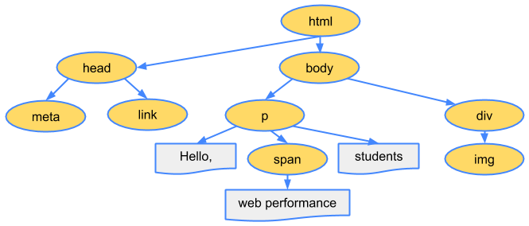

# CRP

从收到 HTML、CSS 和 JavaScript 字节到对其进行必需的处理，从而将它们转变成渲染的像素这一过程即关键渲染路径 (Critical Rendering Path)。

## 构建对象模型

### 文档对象模型 (DOM)

`字节 -> 字符 -> 令牌 -> 节点 -> DOM`

1. **转换:** 浏览器从磁盘或网络读取 HTML 的原始字节，并根据文件的指定编码（例如 UTF-8）将它们转换成各个字符。
2. **令牌化:** 浏览器将字符串转换成 W3C HTML5 标准规定的各种令牌，例如，“<html>”、“<body>”，以及其他尖括号内的字符串。每个令牌都具有特殊含义和一组规则。
3. **词法分析:** 发出的令牌转换成定义其属性和规则的“对象”。
4. **DOM 构建:** 最后，由于 HTML 标记定义不同标记之间的关系（一些标记包含在其他标记内），创建的对象链接在一个树数据结构内，此结构也会捕获原始标记中定义的父项-子项关系: HTML 对象是 body 对象的父项，body 是 paragraph 对象的父项，依此类推。

举个栗子：

```html
<!DOCTYPE html>
<html>
  <head>
    <meta name="viewport" content="width=device-width,initial-scale=1">
    <link href="style.css" rel="stylesheet">
    <title>Critical Path</title>
  </head>
  <body>
    <p>Hello <span>web performance</span> students!</p>
    <div></div>
  </body>
</html>
```



### CSS 对象模型 (CSSOM)

构建 CSSOM 的流程和上面的 DOM 的流程一致。

`字节 -> 字符 -> 令牌 -> 节点 -> CSSOM`

还是上面的例子，在浏览器构建 DOM 时，head 部分遇到了一个 link 标记，它会立即发出请求获取 style.css，并返回以下内容:

```css
body { font-size: 16px }
p { font-weight: bold }
span { color: red }
p span { display: none }
img { float: right }
```


注意：这并非实际的最终样式表，因为每个浏览器会有自身的默认样式(User Agent)

## 渲染树构建、布局及绘制

### 渲染树构建

1. 从 DOM 树的根节点开始遍历每个可见节点。
  - 某些节点不可见（例如脚本标记、元标记等），因为它们不会体现在渲染输出中，所以会被忽略。
  - 某些节点通过 CSS 隐藏，因此在渲染树中也会被忽略，例如，上例中的 span 节点---不会出现在渲染树中，---因为有一个显式规则在该节点上设置了“display: none”属性。
2. 对于每个可见节点，为其找到适配的 CSSOM 规则并应用它们。
3. 发射可见节点，连同其内容和计算的样式。


### 布局

布局流程的输出是一个“盒模型”，它会精确地捕获每个元素在视口内的确切位置和尺寸: 所有相对测量值都转换为屏幕上的绝对像素。

### 绘制

将渲染树中的每个节点转换成屏幕上的实际像素。
