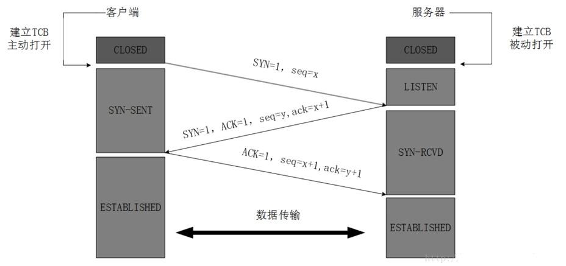
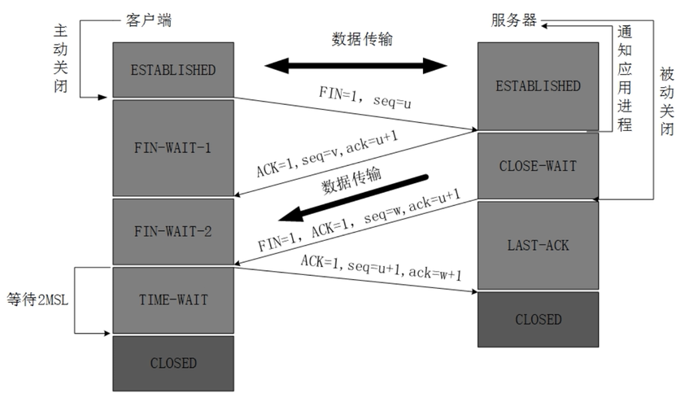
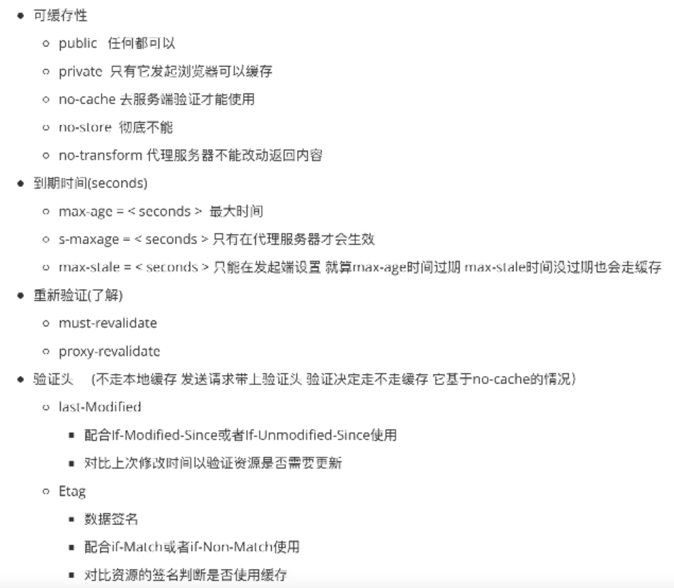
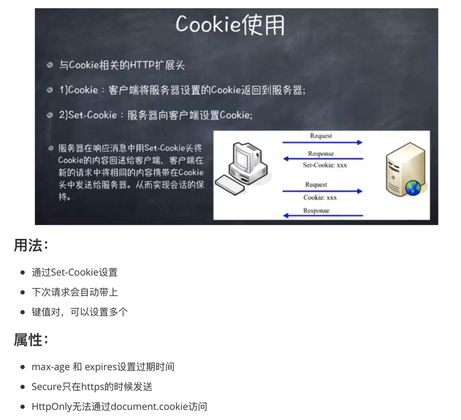
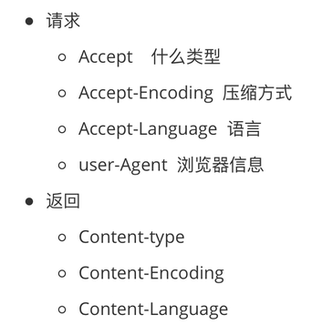
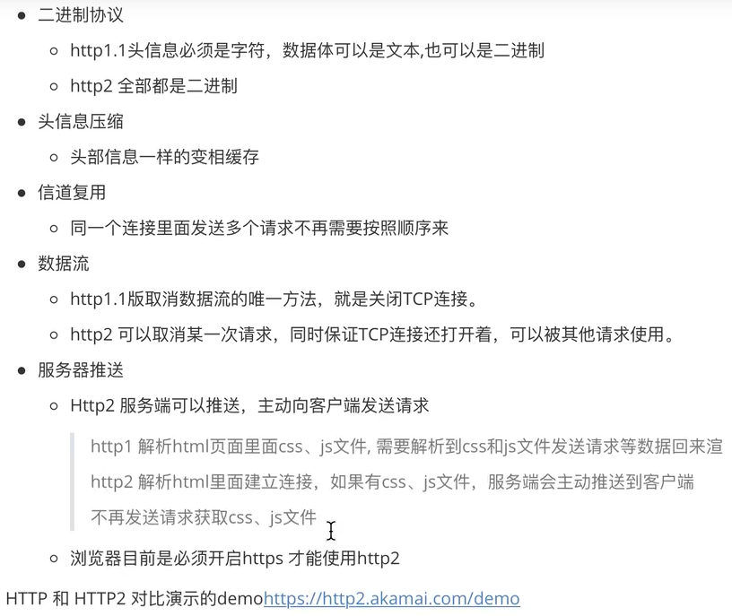
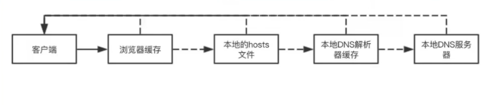
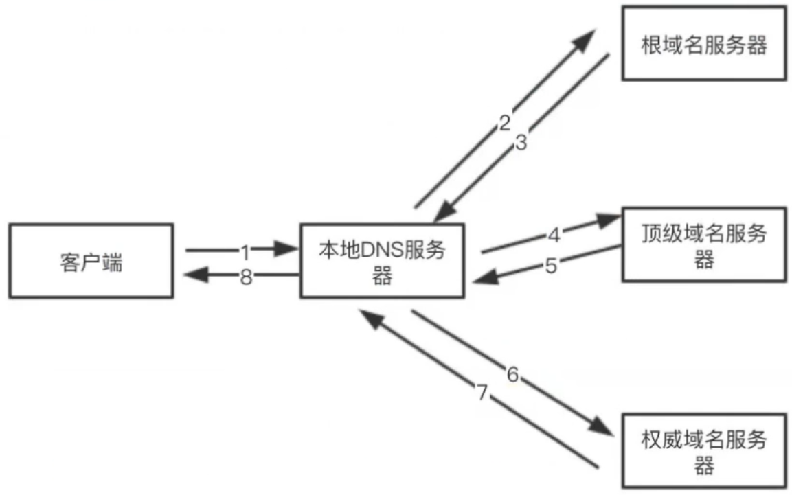

HTTP
---

**一次完整的HTTP服务过程**

1. 在浏览器地址栏输入URL
2. 浏览器查看缓存，如果请求资源在缓存中并且新鲜，跳转到解码步骤15
   - 如果资源未缓存，发起新请求
   - 如果已缓存，检验是否足够新鲜，足够新鲜直接提供给客户端，否则与服务器进行验证资源是否更新。
     - HTTP1.0提供Expires，值为一个绝对时间表示缓存新鲜日期
     - HTTP1.1增加了Cache-Control: max-age=,值为以秒为单位的最大新鲜时间
3. 浏览器解析URL获取协议，主机，端口，path
4. 浏览器组装一个HTTP（GET）请求报文
5. 浏览器获取主机ip地址，过程如下：
   1. 浏览器缓存
   2. 本机缓存
   3. hosts文件
   4. 路由器缓存
   5. ISP DNS缓存
   6. DNS递归查询（可能存在负载均衡导致每次IP不一样）
6. 打开一个socket与目标IP地址，端口建立TCP链接，三次握手如下：
   1. 客户端发送一个TCP的SYN=1，Seq=X的包到服务器端口
   2. 服务器发回SYN=1， ACK=X+1， Seq=Y的响应包
   3. 客户端发送ACK=Y+1， Seq=Z
7. TCP链接建立后发送HTTP请求
8. 服务器接受请求并解析，将请求转发到服务程序，如虚拟主机使用HTTP Host头部判断请求的服务程序
9. 服务器检查HTTP请求头是否包含缓存验证信息如果验证缓存新鲜，返回304等对应状态码
10. 处理程序读取完整请求并准备HTTP响应，可能需要查询数据库等操作
11. 服务器将响应报文通过TCP连接发送回浏览器
12. 浏览器接收HTTP响应，然后根据情况选择关闭TCP连接或者保留重用，关闭TCP连接的四次握手如下：
    1. 主动方发送Fin=1， Ack=Z， Seq= X报文
    2. 被动方发送ACK=X+1， Seq=Z报文
    3. 被动方发送Fin=1， ACK=X， Seq=Y报文
    4. 主动方发送ACK=Y， Seq=X报文
13. 浏览器检查响应状态吗：是否为1XX，3XX， 4XX， 5XX，这些情况处理与2XX不同
14. 如果资源可缓存，进行缓存
15. 对响应进行解码（例如gzip压缩）
16. 根据资源类型决定如何处理（假设资源为HTML文档）
17. 解析HTML文档，构件DOM树，下载资源，构造CSSOM树，执行js脚本，这些操作没有严格的先后顺序，以下分别解释
18. 构建DOM树：
    1. Tokenizing：根据HTML规范将字符流解析为标记
    2. Lexing：词法分析将标记转换为对象并定义属性和规则
    3. DOM construction：根据HTML标记关系将对象组成DOM树
19. 解析过程中遇到图片、样式表、js文件，启动下载
20. 构建CSSOM树：
    1. Tokenizing：字符流转换为标记流
    2. Node：根据标记创建节点
    3. CSSOM：节点创建CSSOM树
21. 根据DOM树和CSSOM树构建渲染树
    1. 从DOM树的根节点遍历所有可见节点，不可见节点包括：1）script,meta这样本身不可见的标签。2)被css隐藏的节点，如display: none
    2. 对每一个可见节点，找到恰当的CSSOM规则并应用
    3. 发布可视节点的内容和计算样式
22. js解析如下：
    1. 浏览器创建Document对象并解析HTML，将解析到的元素和文本节点添加到文档中，此时document.readystate为loading
    2. HTML解析器遇到没有async和defer的script时，将他们添加到文档中，然后执行行内或外部脚本。这些脚本会同步执行，并且在脚本下载和执行时解析器会暂停。这样就可以用document.write()把文本插入到输入流中。同步脚本经常简单定义函数和注册事件处理程序，他们可以遍历和操作script和他们之前的文档内容
    3. 当解析器遇到设置了async属性的script时，开始下载脚本并继续解析文档。脚本会在它下载完成后尽快执行，但是解析器不会停下来等它下载。异步脚本禁止使用document.write()，它们可以访问自己script和之前的文档元素
    4. 当文档完成解析，document.readState变成interactive
    5. 所有defer脚本会按照在文档出现的顺序执行，延迟脚本能访问完整文档树，禁止使用document.write()
    6. 浏览器在Document对象上触发DOMContentLoaded事件
    7. 此时文档完全解析完成，浏览器可能还在等待如图片等内容加载，等这些内容完成载入并且所有异步脚本完成载入和执行，document.readState变为complete，window触发load事件
23.显示页面（HTML解析过程中会逐步显示页面）

**HTTP发展史**

http 0.9:

- 只有GET，没有header等，服务器发送完就关闭TCP连接

http 1.0：

- 增加了POST和HEAD
- status code
- header
- 多字符集支持
- 权限
- 缓存
- 内容编码
- 多部分发送

缺点：

- TCP连接后发送完数据就关闭(加入非标准字段Connection:keep-alive)

http 1.1：

- 增加OPTIONS PUT PATCH DELETE TRACE CONNECT
- 持久连接
- 增加host

缺点：

- TCP可以复用 但只能同时处理一个请求(减少请求/多开)

http 2：

- 二进制传输
- 信道复用
- 分帧传输
- server push

**三次握手**

为了确保连接的可靠性

为什么是三次握手而不是两次

- 为了实现可靠数据传输， TCP 协议的通信双方， 都必须维护一个序列号， 以标识发送出去的数据包中， 哪些是已经被对方收到的。 三次握手的过程即是通信双方相互告知序列号起始值， 并确认对方已经收到了序列号起始值的必经步骤
- 如果只是两次握手， 至多只有连接发起方的起始序列号能被确认， 另一方选择的序列号则得不到确认

**四次挥手**

确保数据能够完成传输

**HTTP报文**

- 请求报文
  - 请求行
  - 消息报文
  - 请求正文
- 响应报文
  - 状态行
  - 消息报文
  - 响应正文

**HTTP请求方法**

GET POST PUT DELETE HEAD TRACE CONNECT OPTIONS

**HTTP状态码**

- 1xx：指示信息——请求已接收，继续处理
- 2xx：成功信息——请求被成功接收、理解、接受
- 3xx：重定向——就重定向
- 4xx：客户端错误——就客户端错误
- 5xx：服务端错误——就服务端错误

**跨域问题**

[戳这里](./跨域解决方案.md)

**Catch-Control**

**Cookie**

**HTTP长连接**

- Connection：keep-alive/colse

**数据协商**

**CSP(内容安全策略)**

**HTTPS**

**HTTP2**

**DNS解析过程**

