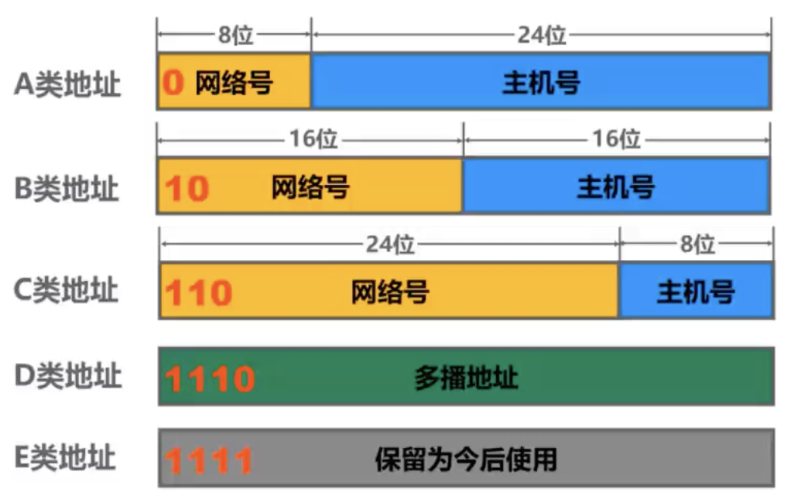
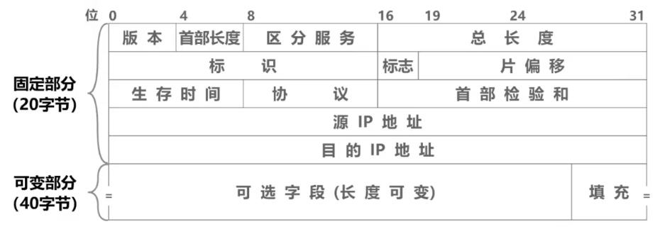
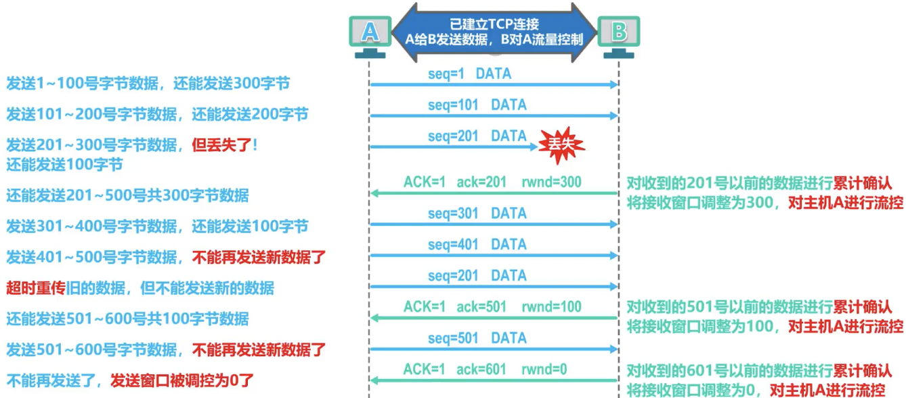
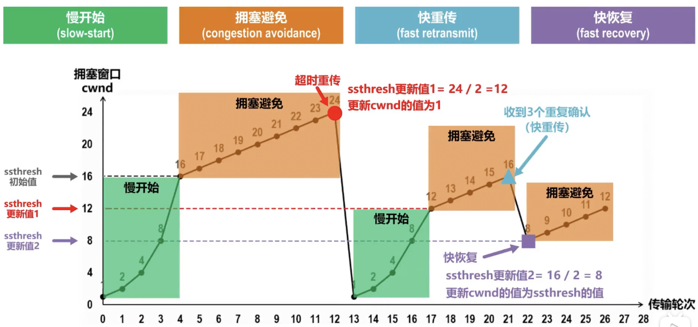
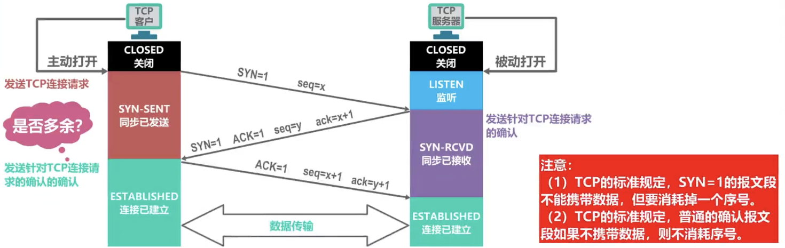
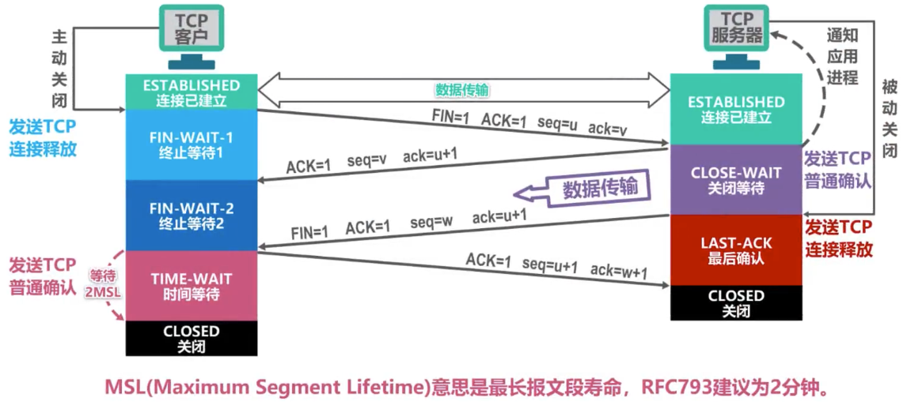
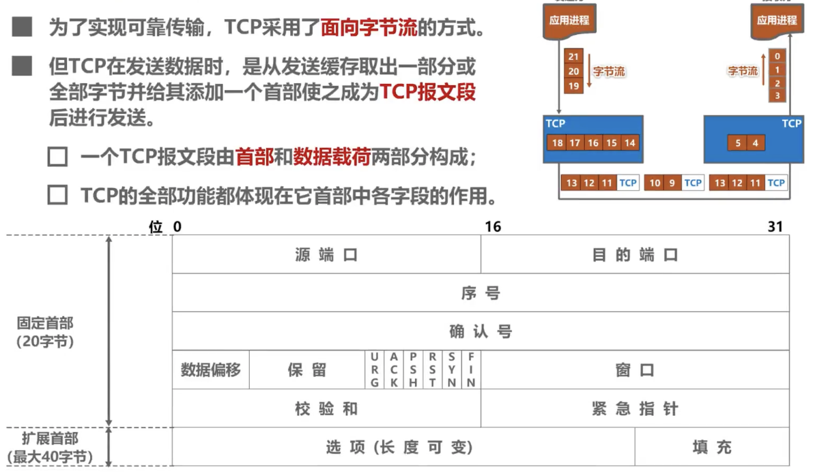
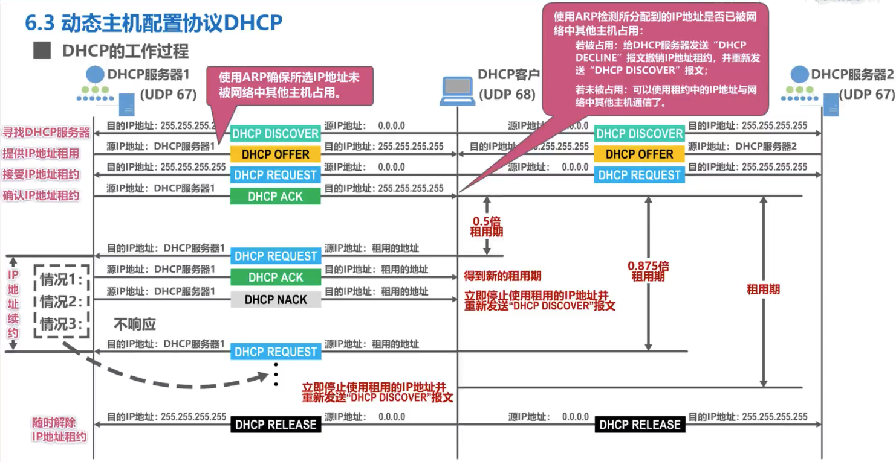
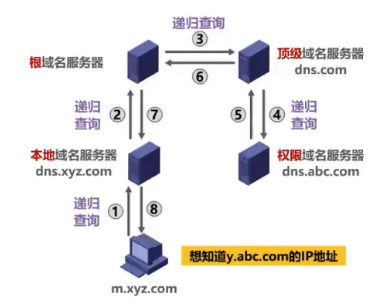
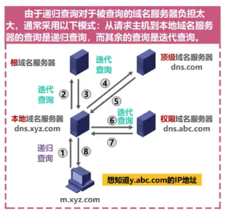

# TCP/IP

TCP/IP 是指由 FTP、SMTP、TCP、UDP、IP 等协议构成的能够在多个不同网络间实现信息传输的协议簇。

## TCP/IP 与 OSI 模型

|TCP/IP|OSI|
|-|-|
|应用层|应用层|
|-|表示层|
|-|会话层|
|传输层|传输层|
|网络层|网络层|
|网络接口层|数据链路层|
|物理层|物理层|

## 数据链路层

...

## 网络层

### 概述

**主要任务**：实现网络互连，进而实现数据包在个网络之间的传输
**主要解决问题**：
- 网络层想运输层提供`可靠传输`还是`不可靠传输`服务
- 网络层寻址问题
- 路由选择问题

### 网络层提供的两种服务 *

|-|面向连接的虚电路服务|无连接的数据报服务|
|-|-|-|
|思路|可靠通信应当由网络来保证|可靠通信应当由用户主机来保证|
|连接的建立|必须建立网络层连接|不需要建立网络层连接|
|终点地址|仅在连接建立阶段使用，每个分组使用短的虚电路号|每个分组都有终点的完整地址|
|分组的转发|属于同一条虚电路的分组均按照同一路由进行转发|每个分组可走不同的路由|
|当结点出故障时|所有通过出故障的结点的虚电路均不能工作|出故障的结点可能会丢失分组，-些路由可能会发生变化|
|分组的顺序|总是按发送顺序到达终点|到达终点时不一-定按发送顺序|
|服务质量保证|可以将通信资源提前分配给每一个虚电路， 容易实现|很难实现

### IPv4

#### 概述 *

IPv4就是给因特网上的每一台主机或路由器的每一个接口分配一个在全世界范围内是唯一的`32`比特的标识符。由于不方便阅读记录以及输入，因此采用`点分十进制表示法`。IPv4编址经历了三个历史阶段，分别是：
1. 分类编址
2. 划分子网
3. 无分类编址

#### 分类编址

- 只有 A B C 类地址可分配给网络中的主机或路由器的各接口
- 主机号全0的地址是网络地址，全1是广播地址，都不能分配




#### 划分子网

为新增网络申请新的网络号会带来以下弊端:

- 需要等待时间和花费更多的费用
- 会增加其他路由器中路由表记录的数量
- 浪费原有网络号中剩余的大量IP地址

可以从主机号部分借用一部分比特作为子网号

32比特的子网掩码可以表明分类IP地址的主机号部分被借用了几个比特作为子网号

- 子网掩码使用连续的比特1来对应网络号和子网号
- 子网掩码使用连续的比特0来对应主机号
- 将划分子网的IPv4地址与其相应的子网掩码进行逻辑与运算就可得到IPv4地址所在子网的网络地址

```
例如 192.168.1.2 的子网掩码是 255.255.255.128
即 11111111 11111111 11111111 10000000
前三个字节为网络号，向主机号部分借用1个比特作为子网号
即划分出来的子网数量是2
```

给定一个分类的IP地址和其相应的子网掩码，就可知道子网划分的细节:

- 划分出的子网数量
- 每个子网可分配的IP地址数量
- 每个子网的网络地址和广播地址
- 每个子网可分配的最小和最大地址

```
还是上面的例子，我们可以得出
- 划分出的子网数量 --- 2
- 每个子网可分配的IP地址数量 --- 2^7 - 2
- 每个子网的网络地址和广播地址（懒得算成点分十进制了╥﹏╥）
  - 第一个子网的网络地址  --- 11111111 11111111 11111111 00000000
  - 第一个子网的广播地址  --- 11111111 11111111 11111111 01111111
  - 第二个子网的网络地址  --- 11111111 11111111 11111111 10000000
  - 第二个子网的广播地址  --- 11111111 11111111 11111111 11111111
- 每个子网可分配的最小和最大地址
  - 第一个子网可分配的最小地址  --- 11111111 11111111 11111111 00000001
  - 第一个子网可分配的最大地址  --- 11111111 11111111 11111111 01111110
  - 第二个子网可分配的最小地址  --- 11111111 11111111 11111111 10000001
  - 第二个子网可分配的最大地址  --- 11111111 11111111 11111111 11111110
```

默认的子网掩码是指在未划分子网的情况下使用的子网掩码。

- A类: 255.0.0.0
- B类: 255.255.0.0
- C类: 255.255.255.0

#### 无分类编址

划分子网在一定程度上缓解了因特网在发展中遇到的困难，但是数量巨大的C类网因为其地址空间太小并没有得到充分使用，而因特网的IP地址仍在加速消耗，整个IPv4地址空间面临全部耗尽的威胁。为此，因特网工程任务组IETF又提出了采用无分类编址的方法来解决IP地址紧张的问题，同时还专门成立IPv6工作组负责研究新版本IP以彻底解决IP地址耗尽问题。

1993年， IETF发布了无分类域间路由选择CIDR(Classless Inter- Domain Routing)的RFC文档: RFC 1517~1519和1520

- CIDR消除了 传统的A类、B类和C类地址，以及划分子网的概念;
- CIDR可以更加有效地分配IPv4的地址空间， 并且可以在新的IPv6使用之前允许因特网的规模继续增长。

CIDR使用“斜线记法”，或称CIDR记法。即在IPv4地址后面加上斜线`/`，在斜线后面写上网络前缀所占的比特数量。

CIDR实际上是将网络前缀都相同的连续的IP地址组成-个“CIDR地址块”。

我们只要知道CIDR地址块中的任何一个地址，就可以知道该地址块的全部细节:

- 地址块的最小地址
- 地址块的最大地址
- 地址块中的地址数量
- 地址块聚合某类网络(A类、 B类或C类)的数量
- 地址掩码 (也可继续称为子网掩码)

路由聚合(构造超网)的方法是找共同前缀

网络前缀越长，地址块越小，路由越具体;

若路由器查表转发分组时发现有多条路由可选，则选择网络前缀最长的那条,这称为最长前缀匹配，因为这样的路由更具体

#### IPv4地址的应用规划 *

|定长的子网掩码FLSM|变长的子网掩码VLSM|
|-|-|
|使用同一个子网掩码来划分子网|使用不同的子网掩码来划分子网|
|子网划分方式不灵活: 只能划分出2^n个子网(n是从主机号部分借用的用来作为子网号的比特数量)|子网划分方式灵活: 可以按需分配|
|每个子网所分配的IP地址数量相同，容易造成IP地址浪费。|每个子网所分配的IP地址数量可以不同，尽可能减少对IP地址的浪费|

#### IP数据报的发送和转发

主机发送IP数据报
1. 判断目的主机是否与自己在同一个网络
2. 若在同一个网络,则属于直接交付;
3. 若不在同一个网络,则属于间接交付，传输给主机所在网络的默认网关(路由器)，由默认网关帮忙转发; 

路由器转发IP数据报
1. 检查IP数据报首部是否出错:
  - 若出错，则直接丢弃该IP数据报并通告源主机;
  - 若没有出错，则进行转发;
2. 根据IP数据报的目的地址在路由表中查找匹配的条目:
  - 若找到匹配的条目，则转发给条目中指示的下一跳;
  - 若找不到，则丢弃该IP数据报并通告源主机;

#### 静态路由配置及其可能产生的路由环路问题
静态路由配置是指用户或网络管理员使用路由器的相关命令给路由器人工配置路由表。

  - 这种人工配置方式简单、开销小。但不能及时适应网络状态(流量、拓扑等)的变化。
  - 一般只在小规模网络中采用。

使用静态路由配置可能出现以下导致产生路由环路的错误

  - 配置错误
  - 聚合了不存在的网络
  - 网络故障

路由条目的类型

  - 直连网络
  - 静态路由(人工配置)
  - 动态路由(路由选择协议)

特殊的静态路由条目
  - 默认路由(目的网络为0.0.0.0, 地址掩码为0.0.0.0)
  - 特定主机路由( 目的网络为特定主机的IP地址，地址掩码为255.255.255.255)
  - 黑洞路由(下一跳为null0)

### 路由选择协议

#### 概述

路由选择协议分静态路由选择，动态路由选择两种

因特网采用分层次的路由选择协议，内部网关协议IGP，外部网关协议EGP。

|路由表|转发表|
|-|-|
|一般仅包含从目的网路到下一跳的映射|从路由表得出|
|需要对网络拓扑变化的计算最优化|转发表的结构应当使查找过程最优化|

#### 路由信息协议RIP的基本工作原理

路由信息协议RIP(Routing Information Protocol)是内部网关协议IGP中最先得到广泛使用的协议之一， 其相关标准文档为RFC 1058。
RIP要求自治系统AS内的每一个路由器都要维护从它自己到AS内其他每一个网络的距离记录。这是一组距离, 称为“距离向量”。

RIP使用跳数(Hop Count)作为度量(Metric)来衡量到达目的网络的距离。
- 路由器到直连网络的距离定义为1。
- 路由器到非直连网络的距离定义为所经过的路由器数加1。
- 允许-条路径最多只能包含15个路由器。 “距离”等于16时相当于不可达。因此，RIP只适用于小型互联网。

RIP认为好的路由就是“距离短”的路由，也就是所通过路由器数量最少的路由。

当到达同一目的网络有多条“距离相等”的路由时，可以进行等价负载均衡。

RIP包含以下三个要点:
- 仅和相邻路由器交换信息
- 仅交换自己的路由表
- 周期性交换(例如每30秒)

RIP的基本工作过程
1. 路由器刚开始工作时，只知道自己到直连网络的距离为1。
2. 每个路由器仅和相邻路由器周期性地交换并更新路由信息。
3. 若干次交换和更新后，每个路由器都知道到达本AS内各网络的最短距离和下一跳地址，称为收敛。

RIP的路由条目的更新规则
- 发现了新的网络,添加
- 到达目的网络，相同下一跳，最新消息，更新
- 到达目的网络，不同下一跳，新路由优势，更新
- 到达目的网络，不同下一跳，新路由劣势，不更新
- 到达目的网络，不同下一-跳,等价负载均衡

RIP存在”坏消息传播得慢”的问题

“坏消息传播得慢” 又称为路由环路或距离无穷计数问题，这是距离向量算法的一个固有问题。可以采取多种措施减少出现该问题的概率或减小该问题带来的危害。
- 限制最大路径距离为15 (16表示不可达)
- 当路由表发生变化时就立即发送更新报文(即“触发更新”)，而不仅是周期性发送
- 让路由器记录收到某特定路由信息的接口，而不让同-路由信息再通过此接口向反方向传送(即“水平分割”)

#### OSPF BGP

感觉有点偏门了，暂时不了解这部分知识

#### IP数据报



### ICMP
カ了更有效地转发IP数据报和提高交付成功的机会，在网际居使用了网际控制报文协议ICMP(Internet Control Message Protocol)。
- 主机或路由器使用ICMP来友送差错报告报文和询问扱文。
- ICMP报文被封装在IP数据扱中发送。
- ICMP差错报告报文共有以下五种:
  - 终点不可达
  - 源点抑制
  - 时间超过
  - 参数问题
  - 改变路由（重定向）

以下情况不应发送ICMP差错报告报文：
- 对ICMP差错报告报文不再发送ICMP差错报告报文
- 对第一个分片的数据报片的所有后续数据报片都不发送
- 对具有多播地址的数据报都不发送
- 对具有特殊地址(如127.0.0.0或0.0.0.0) 的数据报不发送ICMP差错报告报文

常用的ICMP询问报文有以下两种:
- 回送请求和回答
- 时间戳请求和回答

ICMP作用
- 分组网间探测PING
- 跟踪路由traceroute

## 运输层

### 概述

运输层为运行在不同主机上的应用进程提供直接的通信服务，运输层
协议又称为端到端协议。它向高层用户屏蔽了下面网络核心的细节(如网络拓扑、所采用的路由选择协议等)，它使应用进程看见的就好像是在两个运输层实体之间有一条端到端的`逻辑通信信道`。

根据应用需求的不同，因特网的运输层为应用层提供了两种不同的运输协议，即`面向连接的TCP`和`无连接的UDP`，这两种协议就是本章要讨论的主要内容。

### 端口号、复用、分用


### TCP 和 UDP 的区别

|用户数据报协议UDP|传输控制协议TCP|
|-|-|
|无连接|面向连接|
|支持一对一，一对多，多对一和多对多交互通信|每一条TCP连接只能有两个端点EP，只能是一对一通信|
|对应用层交付的报文直接打包|面向字节流|
|尽最大努力交付,也就是不可靠传输，不使用流量控制和拥塞控制。|可靠传输，使用流量控制和拥塞控制。|
|首部开销小，仅8字节|首部最小20字节，最大60字节|

### TCP 的流量控制

一般来说，我们总是希望数据传输得更快一些。但如果发送方把数据发送得过快，接收方就可能来不及接收，这就会造成数据的丢失。

所谓流量控制(flow control)就是让发送方的发送速率不要太快，要让接收方来得及接收。

利用滑动窗口机制可以很方便地在TCP连接上实现对发送方的流量控制。

- TCP接收方利用自己的接收窗口的大小来限制发送方发送窗口的大小。
- TCP发送方收到接收方的零窗口通知后，应启动持续计时器。持续计时器超时后，向接收方发送零窗口探测报文。



### TCP 的拥塞控制



#### 慢开始

假设当前发送方拥塞窗口cwnd的值为1，而发送窗口swnd等于拥塞窗口cwnd，因此发送方当前只能发送一个数据报文段（拥塞窗口cwnd的值是几，就能发送几个数据报文段），接收方收到该数据报文段后，给发送方回复一个确认报文段，发送方收到该确认报文后，将拥塞窗口的值变为2，

1. 发送方的拥塞窗口cwnd=1，则发送窗口swnd=cwnd=1
2. 因此发送方当前只能发送1个数据报文段
3. 接收方收到该数据报文段后，给发送方回复一个确认报文段
4. 发送方收到该确认报文后，将拥塞窗口的值变为2
5. 发送方的拥塞窗口cwnd+=1，则发送窗口swnd=cwnd=2
6. ...+2 +4 +8一直到慢开始门限值，之后改用拥塞避免算法

#### 拥塞避免

从慢开始门限开始，拥塞窗口依次线性+1，发送方每发出一个报文段都会启动一个超时重传计时器，如果规定时间内没有收到接收方的确认报文段，发送方会判断可能出现拥塞，则会：
1. 更改拥塞窗口cwnd为1
2. 更改慢开始门限值ssthresh为当前发生拥塞时的cwnd的一半
3. 慢开始
4. 拥塞避免

#### 快重传

个别丢失的报文段也会导致发送方超时重传，并误以为是网络拥塞，错误地开始慢开始算法，降低效率。

1. 发送方发送m3丢失，继续发送m4
2. 接收方发现这不是按序到达的报文段，会连续重复确认m2三次
3. 发送方收到3个连续对m2的重复确认，立即重传m3


#### 快恢复

发送方把慢开始门限和拥塞窗口调整为当前窗口的一半（有的算法会+3），然后开始执行拥塞避免算法

### TCP超时重传时间的选择

出现超时重传时，新的RTO=2倍的旧RTO（超时重传时间）

### TCP可靠传输的实现

TCP基于以字节为单位的滑动窗口来实现可靠传输。
- 发送方在未收到接收方的确认时，可将发送窗口内还未发送的数据全部发送出去;
- 接收方只接收序号落入发送窗口内的数据;

虽然发送方的发送窗口是根据接收方的接收窗口设置的，但在同一时刻，发送方的发送窗口并不总是和接收方的接收窗口一样大。网络传送窗口值需要经历一定的时间滞后，并且这个时间还是不确定的。
- 发送方还可能根据网络当时的拥塞情况适当减小自己的发送窗口尺寸。
对于不按序到达的数据应如何处理，TCP并无明确规定。
- 如果接收方把不按序到达的数据一律丟弃,那么接收窗口的管理将会比较简单，但这样做对网络资源的利用不利，因为发送方会重复传送较
多的数据。

TCP通常对不按序到达的数据是先临时存放在接收窗口中，等到字节流中所缺少的字节收到后，再按序交付上层的应用进程。
TCP要求接收方必须有累积确认和捎带确认机制，这样可以减小传输开销。接收方可以在合适的时候发送确认，也可以在自己有数
据要发送时把确认信息顺便捎带上。
- 接收方不应过分推迟发送确认，否则会导致发送方不必要的超时重传,这反而浪费了网络的资源。TCP标准规定，确认推迟的时间不应超过0.5秒。若收到-连串具有最大长度的报文段，则必须每隔一个报文段就发送一个确认[RFC 1122]。
- 捎带确认实际上并不经常发生,因为大多数应用程序很少同时在两个方向上发送数据。

TCP的通信是全双工通信。通信中的每一方都在发送和接收报文段。 因此，每一方都有自己的发送窗口和接收窗口。在谈到这些窗口时，一定要弄清楚是哪一方的窗口。

### TCP三次握手

主要为了使TCP双方能够确知对方的存在



**为什么是三次握手而不是两次**

三次握手是建立连接的最小代价。如果是两次握手，有这种情况：
1. 客户端发送建立请求连接，因为某些原因没有送达
2. 超时重传，第二次发送建立请求连接
3. 服务端收到，发送确认连接
4. 发送数据balaba，然后断开连接
5. 这时候`1`的建立请求连接经过一个世纪终于发到服务器了
6. 服务器以为客户端又要连接，所以发送确认连接
7. 但客户端已经关闭了，所以不知道有这次连接
8. 服务器会一直等等等，会浪费资源

### TCP四次挥手



**为什么客户端发送最后一次确认报文段后不立即关闭连接？**

假设有这种情况发生

1. 客户端发送最后一次确认报文段丢失
2. 客户端立即关闭了连接
3. 服务端会因为收不到客户端的确认而超时重传
4. 客户端因为关闭了连接收不到服务端重传内容
5. 服务器会一直重传一直等等等，浪费资源

**如果建立连接后客户端主机发生故障，服务器如何避免一直处于等待状态**

1. TCP服务器进程每收到一次TCP客户进程的数据，就重新设置并启动保活计时器(2小时定时)。
2. 若保活计时器定时周期内未收到TCP客户进程发来的数据，则当保活计时器到时后, TCP服务器进程就向TCP客户进程发送-个探测报文段，以后则每隔75秒钟发送一次。
3. 若一连发送10个探测报文段后仍无TCP客户进程的响应，TCP服务器进程就认为TCP客户进程所在主机出了故障,
4. 接着就关闭这个连接。

### TCP首部



## 应用层

### 动态主机配置协议DHCP

动态主机配置协议DHCP提供了一种机制，成为即插即用连网。这种机制允许一台计算机加入新网络时可自动获取IP地址等网络配置信息而不用手工参与。

- 在运输层使用UDP协议封装
- 客户端端口号68，服务器端口号67



### 域名系统DNS

DNS是因特网使用的命名系统，用来域名(www.example.com)转换为IP地址

因特网采用**层级树状结构的域名结构**

`… . 三级域名 . 二级域名 . 顶级域名`

域名服务器可以分为四种类型：

- 根域名服务器
- 顶级域名服务器
- 权限域名服务器
- 本地域名服务器

域名解析有两种查询方式：

1. 递归查询



2. 迭代查询



DNS报文使用运输层的UDP协议进行封装，端口号`53`

### 文件传输协议FTP

FTP客户和服务器之间要建立以下两个并行的TCP连接:

- 控制连接，在整个会话期间一直保持打开，用于传送FTP相关控制命令。
- 数据连接，用于文件传输，在每次文件传输时才建立，传输结束就关闭。
- 默认情况下，FTP使用TCP 21端口进行控制连接，TCP 20端口进行数据连接。但是， 是否使用TCP 20端口建立数据连接与传输模式有关，主动方式使用TCP 20端口,被动方式由服务器和客户端自行协商决定。

### 超文本传输协议HTTP

#### 状态码

|状态码|含义|
|-|-|
|1xx|信息响应|
|2xx|成功响应|
|3xx|重定向|
|4xx|客户端错误|
|5xx|服务端错误|

常见状态码

- 200 

#### 重定向

http重定向
- 永久重定向
  - 301 Moved Permanently - GET不会变 其他可能会变GET
  - 308 Permanent Redirect - 一切不变
- 临时重定向
  - 302 Found - GET不会变 其他可能会变GET
  - 303 See Other - GET不会变 其他可能会变GET 消息主体会丢失
  - 307 Temporary Redirect - 一切不变
- 特殊重定向
  - 304 Not Modified - 使页面跳转到本地陈旧的缓存版本当中

html重定向
```html
<head>
  <meta http-equiv="Refresh" content="0; URL=http://example.com/" />
</head>
```

js重定向
```js
window.location = "http://example.com/";
```

优先级
`http > html > js`

#### HTTPS

直接戳这里[这里](./HTTPS.md)
